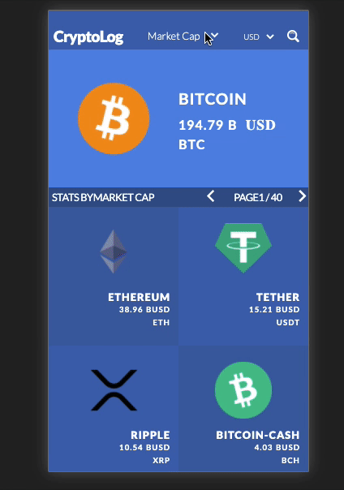

# React Redux Capstone: Catalogue of Statistics for Crypto Assets
[](https://app.netlify.com/sites/anriquez-crypto-assets/deploys)

> Build the front-end of an application to organize a  browsable list of Crypto Assets that can be filtered and accessed to each Asset's details.



Users will browse through a list of Crypto Assets, Filtered by Market Cap, ATH, total Volume in higher to lower order. Also, the user can filter by cryptocurrency name.

## Built With

- React.js, Redux, Webpack, Babel
- HTML5/CSS3, Javascript ES6
- ESlint, Stylelint
- VSCode


## Live Demo @Netlify

[Live Demo Link](https://anriquez-crypto-assets.netlify.app/)

## User Story:

### User will access the URL
- The Single page renders with main Cryptocurrencies ordered by market cap by default.
- In the top center of the page navbar, the user will be able to select the filter options:
        ○ Market Cap
        ○ Circulating Supply
        ○ 24h change vs. ATH%
- Once the filter is selected, the page would render the top 5 cryptocurrencies with the main statistics showing in the main boxes, ordered from higher to lower statistical value.
- In the top left of the page navbar, the user will select the coins' currency.
- The Filtered options will be updated every minute.

### User can click/tab on any Cryptocurrency
- On Asset selected (click/tab) a new page will show displaying 
        a. Market Cap
        b. Last Price
        c. Volume
        d. ATH
        e. High 24hs
        f. Low 24hs

## Getting Started
This project was bootstrapped with [Create React App](https://github.com/facebook/create-react-app).

To get a local copy up and running follow these simple example steps.

### Prerequisites
- To install the app in your system, make sure you have node/npm installed. [get npm](https://www.npmjs.com/get-npm)

### Setup
- Clone the repository in your system by using: 

``` git clone  ```

## Install

- Next step is to CD into the local repository and run:

 ``` npm install ```

### start development mode in your local environment

```npm start```

Runs the app in the development mode.<br />
Open [http://localhost:3000](http://localhost:3000) to view it in the browser.

The page will reload if you make edits.<br />
You will also see any lint errors in the console.

### `npm build`

This command builds the app for production to the `build` folder.<br />
It correctly bundles React in production mode and optimizes the build for the best performance.

The build is minified and the filenames include the hashes.<br />
Your app is ready to be deployed!

See the section about [deployment](https://facebook.github.io/create-react-app/docs/deployment) for more information.


### Run tests

*   Run the test suite app for store actions with
    ```
    $ npm test
    ```


## Authors

👤 ***Carlos Anriquez***

- Github: [@canriquez](https://github.com/canriquez)
- Twitter: [@cranriquez](https://twitter.com/cranriquez)
- Linkedin: [linkedin](https://www.linkedin.com/in/carlosanriquez/)
- Portfolio: [carlosanriquez.com](https://www.carlosanriquez.com)


## 🤝 Contributing

Contributions, issues, and feature requests are welcome!

Feel free to check the [issues page](issues/).

## Show your support

Give a ⭐️ if you like this project!

## Acknowledgments

My family
The Beagles @microverseinc

## 📝 License

This project is [MIT](LICENSE) licensed.